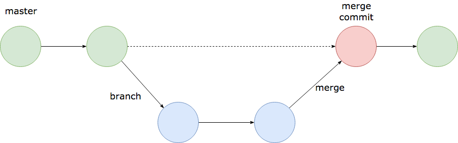
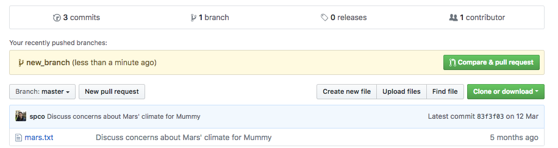
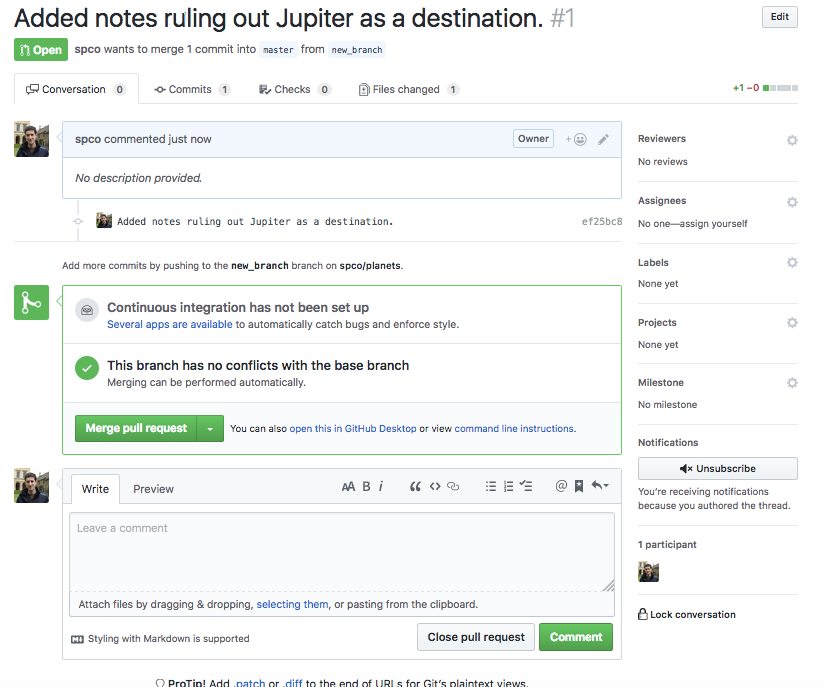

For this next step, you will work on your own, but please bear in mind that what is learnt
can equally be applied to another user's repository e.g. via GitHub. 

The goal of this lesson is to create a new branch for a new feature, and then use GitHub's 
interface to merge the changes from that branch into the master.

Conceptually, what we're going to do is this:

When it comes to the merge step, we will use GitHub to open a Pull Request. This says
"I've made a branch, now please pull the branch into master (via a merge)". Using a 
Pull Request allows us (and the owner/other users of the repository) to see the changes 
that the branch contains. These can be reviewed and altered until satisfactory. Finally,
the merge can be completed via the GitHub interface.

Firstly, ensure you are working on _your_ repository:
~~~
$ cd ~/git-novice/planets
~~~
{: .bash}

Next, ensure that you have the very latest version from GitHub:
~~~
$ git checkout master
$ git fetch origin master
$ git pull origin master
~~~
{: .bash}

To check that everything is up-to-date, we can use lots of options added to the basic 
`git log` command to show us more detail:
~~~
$ git log --oneline --branches --graph --decorate
~~~
{: .bash}

~~~
* 83f3f03 (HEAD -> master, origin/master) Discuss concerns about Mars' climate for Mummy
* 2e764a3 Add concerns about effects of Mars' moons on Wolfman
* 0f787d0 Start notes on Mars as a base.
~~~
{: .output}
This shows us that `HEAD` is at `master` (denoted by the arrow), and `origin/master` is 
at the same point in history.

Now that we're happy that we're up to date, we're going to make a new branch that is 
_based_ on the latest commit on master. Branch names should be descriptive, so `new_branch` is not
usually a good choice.
~~~
$ git branch new_branch
~~~
{: .bash}
Nothing looks to have changed, but if we again use `git log --oneline --branches --graph --decorate`
we see that `new_branch` is now added. 
~~~
* 83f3f03 (HEAD -> master, origin/master, new_branch) Discuss concerns about Mars' climate for Mummy
* 2e764a3 Add concerns about effects of Mars' moons on Wolfman
* 0f787d0 Start notes on Mars as a base.
~~~
{: .output}
But be careful! If we run `git status` we see `On branch master`. So we have created a new branch 
called `new_branch`, but are not on the branch yet. The `git log` command above also indicates this,
because `HEAD` is still pointing to `master`, not to `new_branch`.

We check out the new branch:
~~~
$ git checkout new_branch
~~~
{: .bash}

~~~
Switched to branch 'new_branch'
~~~
{: .output}

~~~
$ git log --oneline --branches --graph --decorate
~~~
{: .bash}

~~~
* 83f3f03 (HEAD -> new_branch, origin/master, master) Discuss concerns about Mars' climate for Mummy
* 2e764a3 Add concerns about effects of Mars' moons on Wolfman
* 0f787d0 Start notes on Mars as a base.
~~~
{: .output}

We're now on the new branch, and so `HEAD -> new_branch`.

Now it's time to make some changes!

Make some changes to mars.txt, or perhaps add a new file. Then add and commit these changes. In
this example, I've added notes on Jupiter to `jupiter.txt`:

~~~
* ef25bc8 (HEAD -> new_branch) Added notes ruling out Jupiter as a destination.
* 83f3f03 (origin/master, master) Discuss concerns about Mars' climate for Mummy
* 2e764a3 Add concerns about effects of Mars' moons on Wolfman
* 0f787d0 Start notes on Mars as a base.
~~~
{: .output}

Note that this latest commit is on `new_branch`, but it hasn't affected `master`.

Let's use GitHub's Pull Request mechanism to merge these changes from `new_branch` into `master`.

~~~
$ git push
~~~
{: .bash}
~~~
fatal: The current branch new_branch has no upstream branch.
To push the current branch and set the remote as upstream, use

    git push --set-upstream origin new_branch
~~~
{: .output}
What's happened here? git doesn't know which branch to push our changes to in the
GitHub repository (the "upstream branch"). But it suggests what it thinks is most 
likely, and it's what we want in this case, so we go ahead and follow the advice:
~~~
$ git push --set-upstream origin new_branch
~~~
{: .bash}
~~~
Counting objects: 3, done.
Delta compression using up to 4 threads.
Compressing objects: 100% (3/3), done.
Writing objects: 100% (3/3), 365 bytes | 365.00 KiB/s, done.
Total 3 (delta 0), reused 0 (delta 0)
To github.com:spco/planets.git
 * [new branch]      new_branch -> new_branch
Branch new_branch set up to track remote branch new_branch from origin.
~~~
{: .output}

We can check what's changed:
~~~
$ git log --oneline --branches --graph --decorate
~~~
{: .bash}
~~~
* ef25bc8 (HEAD -> new_branch, origin/new_branch) Added notes ruling out Jupiter as a destination.
* 83f3f03 (origin/master, master) Discuss concerns about Mars' climate for Mummy
* 2e764a3 Add concerns about effects of Mars' moons on Wolfman
* 0f787d0 Start notes on Mars as a base.
~~~
{: .output}
git is now keeping track of a branch called `origin/new_branch`.

Now switch to the main page of your repo on GitHub. You'll see a yellow banner 
showing that GitHub has noticed you've added a branch. Click on the "Compare & pull request" button.

This page now shows you the changes in this branch. You can have multiple commits, and multiple 
edits to multiple files. Note that allong the top you can see (and edit) which branches are to be 
merged into which others (in our case, `new_branch` is to be merged into `master`).

When you're happy with the changes, click "Create pull request".

You're now on a Pull Request page:

Take a few minutes to look around. You can add general comments, or you can inspect the individual commits, and add comments to lines in the commits. You can tag other users on GitHub with the `@` symbol, e.g. `@spco`. Explore the contents of the "Conversation / Commits / Checks/ Files Changed" tabs across the top.

> ## Add more commits to an open Pull Request
>
> Now that your Pull Request is open, you can add further commits to the branch, and then use `git push`
> to add them to the Pull Request automatically. Try it now. Afterwards, refresh the Pull Request page
> to see the new commit has appeared at the bottom of the timeline.
{: .challenge}

> ## Review Changes and Merge
>
> Note that the "Merge pull request" button has a drop-down menu to the right,
> which allows you to select 3 different types of merge - "Create a merge commit", 
> "Squash and merge" or "Rebase and merge". These all have slightly different behaviours
> and are appropriate in different contexts, but for now "Create a merge commit" 
> is fine. When you're happy that the contents of the Pull Request are as you want them, 
> click the "Merge pull request" button, then "Confirm merge".
>
> Click on the "code" tab at the top of the page to go back to the main page, and check
> that your changes from that branch have now been correctly merged into `master`.
>
> Congratulations! You've merged your first Pull Request!
{: .challenge}

Finally, once we've mergeed our branch on GitHub, we need to clean up on our local repository.

~~~
$ git checkout master
~~~
{: .bash}
~~~
Switched to branch 'master'
Your branch is up-to-date with 'origin/master'.
~~~
{: .output}
~~~
$ git pull origin master
~~~
{: .bash}
~~~
remote: Counting objects: 1, done.
remote: Total 1 (delta 0), reused 0 (delta 0), pack-reused 0
Unpacking objects: 100% (1/1), done.
From github.com:spco/planets
 * branch            master     -> FETCH_HEAD
   83f3f03..b97bc42  master     -> origin/master
Updating 83f3f03..b97bc42
Fast-forward
 jupiter.txt | 1 +
 1 file changed, 1 insertion(+)
 create mode 100644 jupiter.txt
 ~~~
 {: .output}
 ~~~
$ git log --oneline --branches --graph --decorate
~~~
{: .bash}
~~~
*   b97bc42 (HEAD -> master, origin/master) Merge pull request #1 from spco/new_branch
|\  
| * ef25bc8 (origin/new_branch, new_branch) Added notes ruling out Jupiter as a destination.
|/  
* 83f3f03 Discuss concerns about Mars' climate for Mummy
* 2e764a3 Add concerns about effects of Mars' moons on Wolfman
* 0f787d0 Start notes on Mars as a base.
~~~
{: .output}
The last piece of tidying-up is to remove the old branch, if we're happy that it is no longer needed.
~~~
$ git branch -d new_branch
~~~
{: .bash}
